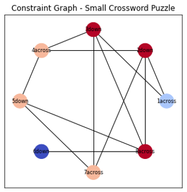

# Crossword Puzzle Solver AI

## Table of Contents

- [Crossword Puzzle Solver AI](#crossword-puzzle-solver-ai)
  - [Table of Contents](#table-of-contents)
  - [Introduction](#introduction)
  - [Heuristics Used](#heuristics-used)
  - [Analysis](#analysis)
    - [Analysis – Small Crossword](#analysis--small-crossword)
    - [Analysis – Large Crossword](#analysis--large-crossword)
    - [Analysis – Heart Crossword](#analysis--heart-crossword)
  - [Discussion](#discussion)
  - [Additional Information](#additional-information)

## Introduction

This project presents a Python-based crossword puzzle solver utilizing a [Constraint Satisfaction Problem (CSP)](https://en.wikipedia.org/wiki/Constraint_satisfaction_problem) approach. The solver is enhanced with various heuristics to improve efficiency and leverages the NetworkX library for creating and visualizing constraint graphs. 

## Heuristics Used

1. **Least Constraining Value Heuristic:**
    - **Implementation:** `order_domain_values_simple` and `order_domain_values` functions.
    - **Description:** Orders the values of a variable based on the number of conflicts they introduce with other assigned variables.

2. **Frequency Heuristic:**
    - **Implementation:** `frequency_heuristic` function.
    - **Description:** Evaluates words based on the frequency of their letters within the crossword puzzle, prioritizing more common letters.

3. **Overlap Heuristic:**
    - **Implementation:** `overlap_heuristic` function.
    - **Description:** Calculates the number of overlapping positions a word has with already assigned variables, favoring words with more overlaps.

4. **Minimum Remaining Values (MRV) Heuristic:**
    - **Implementation:** `select_unassigned_variable` function.
    - **Description:** Selects the variable with the fewest remaining legal values to assign next, reducing the branching factor.

5. **Degree Heuristic:**
    - **Implementation:** `select_unassigned_variable` function.
    - **Description:** Chooses the variable involved in the largest number of constraints with other unassigned variables, aiming to reduce future conflicts.

## Analysis

### Analysis – Small Crossword

For the small crossword puzzle, the constraint graph significantly influenced the order in which variables were evaluated, with nodes representing variables and edges indicating constraints.

<p align="center">
  
  <br>
  Figure 1. Constraint graph for small Crossword.
</p>


The solution for the small crossword is presented below in **Figure 2**. Given the limited dictionary size of 15 words, the complexity of the heuristics had minimal impact on the running time, resulting in an exceptionally quick solution (solved in 0.037 seconds).

*Note:* The variable `2across` was manually omitted to align with the assignment's requirements. Including it without exclusion resulted in no viable solution.

<p align="center">
  
  <br>
  Figure 2. Solution for small Crossword.
</p>


### Analysis – Large Crossword

The constraint graph for the large crossword is depicted below. It played a crucial role in determining the sequence of variable assignments.

<p align="center">
  
  <br>
  Figure 3. Constraint graph for large Crossword.
</p>


Despite implementing multiple heuristics to enhance the AI's reasoning capabilities, the solver failed to find a solution. Debugging revealed that the algorithm became stuck at the sixth variable, exhaustively attempting each possible value through brute force. With 15 variables, the current approach lacks scalability and efficiency, making it impractical for larger puzzles.

<p align="center">
  
  <br>
  Figure 4. No solution for large Crossword.
</p>

### Analysis – Heart Crossword


The heart-shaped crossword presents a more complex scenario with an extensive constraint graph consisting of 52 nodes (variables) and 135 edges (constraints), indicating a high degree of interconnections.

<p align="center">
  
  <br>
  Figure 5. Constraint graph for heart Crossword.
</p>


Similar to the large crossword, the solver was unable to find a solution. It became entangled at the 15th variable, employing brute force to iterate through each possible value. Given the sheer number of variables and the expansive domain of each, the solver's performance suffers significantly.

*Note:* A fictitious variable `34across` was introduced to incorporate the initials "JMS" without disrupting the existing data structure. This was achieved by assigning a single domain value of "JMS" to the variable, allowing the solver to proceed without issues.

<p align="center">
  
  <br>
  Figure 6. No solution for heart Crossword.
</p>


## Discussion

The experimental results indicate that the CSP-based solver performs efficiently on small crossword puzzles with limited dictionaries, as evidenced by the rapid solution time of 0.037 seconds for the small crossword. However, the solver struggles with larger and more complex puzzles, primarily due to the exponential growth of the search space and the limitations of the implemented heuristics.

The solver's inability to handle larger puzzles effectively suggests the necessity for more sophisticated heuristics or alternative algorithms. Approaches such as Forward Checking, Arc Consistency, or implementing Dynamic Variable Ordering could potentially mitigate the issues encountered. Additionally, optimizing data structures and reducing redundant computations might enhance performance.

Balancing heuristic complexity with computational efficiency remains a critical challenge. While advanced heuristics offer improved decision-making capabilities, they may introduce substantial overhead, negating their benefits in larger-scale problems. Future work should focus on refining heuristics to achieve optimal balance and exploring hybrid strategies that combine multiple heuristics for enhanced performance.

## Additional Information

- **Dependencies:** Ensure that all required packages are installed in your Python environment. You can install them using:
  
  ```bash
  pip install numpy json networkx matplotlib
  ```

- **Data Files:** 
  - Place the `Words.txt` file inside the `data/` directory relative to your project root.
  - Ensure that the `solutions/` directory exists for exporting solution files.

- **Execution Time:** 
  - Solving larger puzzles may require significant time due to the complexity of the backtracking algorithm. Consider implementing optimizations or utilizing more advanced algorithms (e.g., Forward Checking, Arc Consistency) to improve performance.
